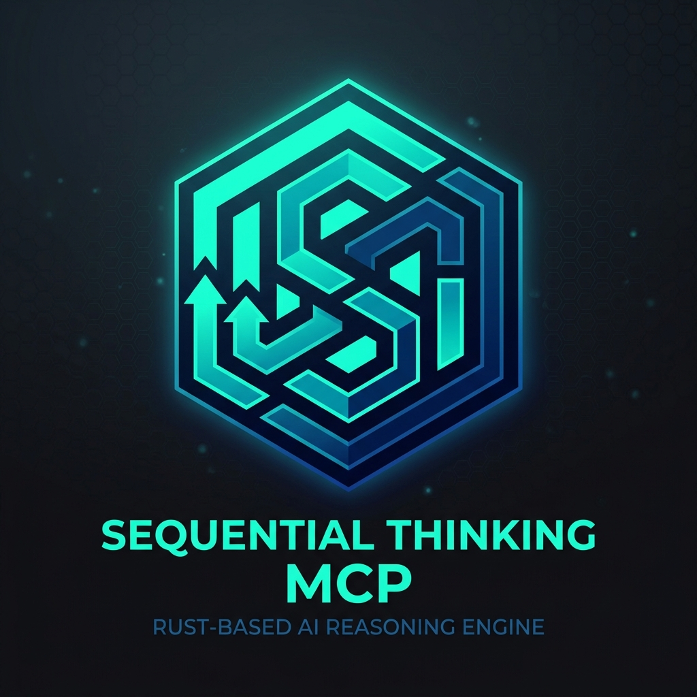
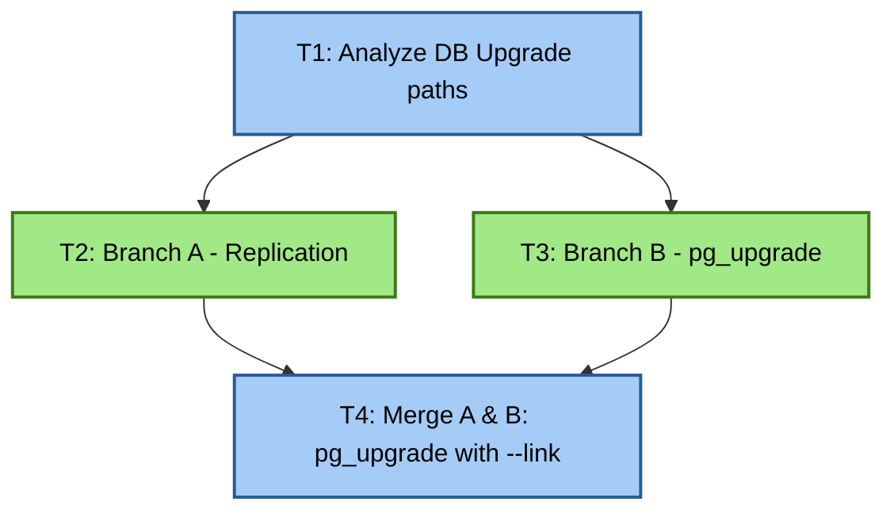

<p align="center">
  
</p>

<h1 align="center">💭 Sequential Thinking MCP Server (Rust)</h1>

<p align="center">
  <strong>A high-performance, graph-structured reasoning server for LLMs and AI agents (like OpenZ). Inspired by the official TypeScript implementation, built entirely in Rust.</strong>
</p>

<p align="center">
  <a href="LICENSE"></a>
  <a href="https://www.rust-lang.org"></a>
</p>

---

## 📖 Inspiration & Origin

This server is inspired by and compatible with the official [Model Context Protocol (MCP) Sequential Thinking Server](https://github.com/modelcontextprotocol/servers/tree/main/src/sequentialthinking). 

While the original TS implementation handles linear sequences, this Rust rewrite introduces next-generation **Graph of Thoughts (GoT)** merging capabilities, **Clear Thought** verification tracking, and extreme performance optimization.

---

## ⚡ Comparison: TS vs. Rust (What's Different?)

| Feature | Original Node.js/TS Server | Enhanced Rust Server |
| :--- | :--- | :--- |
| **Cold-start Latency** | $\sim 150 - 200\text{ ms}$ (V8 startup + require tree) | **$< 1\text{ ms}$** (native execution) |
| **Memory Footprint** | $\sim 30 - 50\text{ MB}$ | **$< 4\text{ MB}$** |
| **Reasoning Model** | Linear Chain + Basic Single Branching | **Directed Acyclic Graph (DAG)** via GoT merging |
| **Clear Thought Track** | None | Confidence scores, assumptions, criticisms, hypotheses |
| **Terminal / TUI box** | Static width formatting | **Dynamic width wrapping** (queries `terminal_size`) |
| **Dependencies** | NPM package tree (`@modelcontextprotocol/sdk`, etc.) | Single compiled binary, zero runtime dependencies |

---

## 🌿 Graph of Thoughts (GoT) in Action

Unlike the traditional linear chain, the Rust version allows the agent to reason concurrently down alternative paths and then **merge** those ideas using `parentThoughts`:



On every tool call, the server returns a compiled `thoughtGraphMermaid` representation of the reasoning history to the client.

---

## 🛠️ Tool Schema: `sequentialthinking`

**Inputs:**
*   `thought` (string, required): Current reasoning, step, or conclusion.
*   `thoughtNumber` (integer, required): The current thought number (starts at 1).
*   `totalThoughts` (integer, required): Current estimate of thoughts needed (dynamic).
*   `nextThoughtNeeded` (boolean, required): Whether another thought is needed.
*   `isRevision` (boolean, optional): Marks if this thought revises a previous step.
*   `revisesThought` (integer, optional): The thought number being revised.
*   `branchFromThought` (integer, optional): The thought number from which this branch starts.
*   `branchId` (string, optional): A string identifying the branch.
*   `parentThoughts` (array of integers, optional): Array of parent thought numbers to merge paths (enables GoT).
*   `assumptions` (array of strings, optional): Explicit assumptions made.
*   `verifiedAssumptions` (array of strings, optional): Assumptions verified or refuted in this step.
*   `confidenceScore` (number, optional): Rating of confidence in this reasoning path (0.0 to 1.0).
*   `criticism` (string, optional): Self-criticism or evaluation of previous steps.

**Outputs:**
*   `thoughtNumber` (integer)
*   `totalThoughts` (integer)
*   `nextThoughtNeeded` (boolean)
*   `branches` (array of active branch IDs)
*   `thoughtHistoryLength` (integer)
*   `thoughtGraphMermaid` (string)
*   `confidenceHistory` (array of confidence scores)

---

## ⚙️ Configuration & Installation

### 1. Build from Source
Compile the release binary:
```bash
cargo build --release
```
The optimized executable will be built at:
`./target/release/mcp-server-sequential-thinking` (or in the parent workspace's `target/release/` folder if compiling in a cargo workspace).

### 2. Configure Claude Desktop
Add this to your `claude_desktop_config.json`:
```json
{
  "mcpServers": {
    "sequential-thinking": {
      "command": "/absolute/path/to/target/release/mcp-server-sequential-thinking",
      "args": []
    }
  }
}
```

### 3. Disable Logging
To run without printing the graphical thought boxes to `stderr`, set the environment variable:
```bash
DISABLE_THOUGHT_LOGGING=true
```
Or run the binary with the `-d` / `--disable-thought-logging` flag:
```bash
mcp-server-sequential-thinking --disable-thought-logging
```

---

## 📚 Documentation

Detailed documentation is available in the [docs/](file:///home/aswin/programming/vscode/myProjects/ai_agent_tools/sequentialthinking_rs/docs) folder:
*   [Architecture Overview](file:///home/aswin/programming/vscode/myProjects/ai_agent_tools/sequentialthinking_rs/docs/architecture.md)
*   [Code Structure & Layout](file:///home/aswin/programming/vscode/myProjects/ai_agent_tools/sequentialthinking_rs/docs/code_structure.md)
*   [GoT & Clear Thought In-Depth Guide](file:///home/aswin/programming/vscode/myProjects/ai_agent_tools/sequentialthinking_rs/docs/got_and_clear_thought.md)
*   [Agent Setup Guide](file:///home/aswin/programming/vscode/myProjects/ai_agent_tools/sequentialthinking_rs/docs/install_instruction.md)
*   [Future Updates & Roadmap](file:///home/aswin/programming/vscode/myProjects/ai_agent_tools/sequentialthinking_rs/docs/future_update.md)

## 📄 License
This project is licensed under the MIT License - see the LICENSE file for details.
